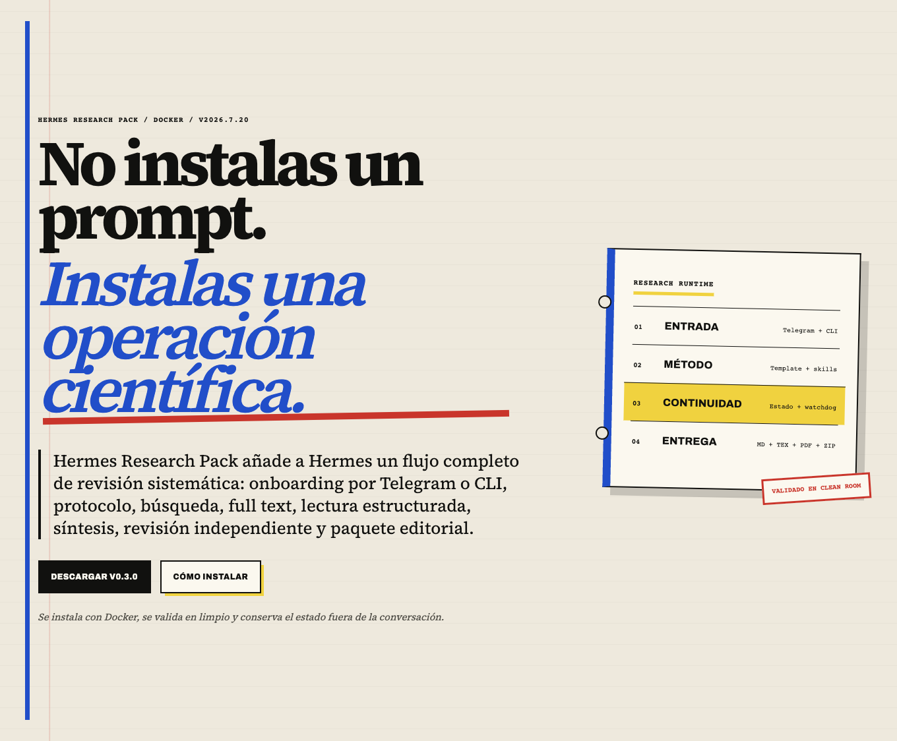
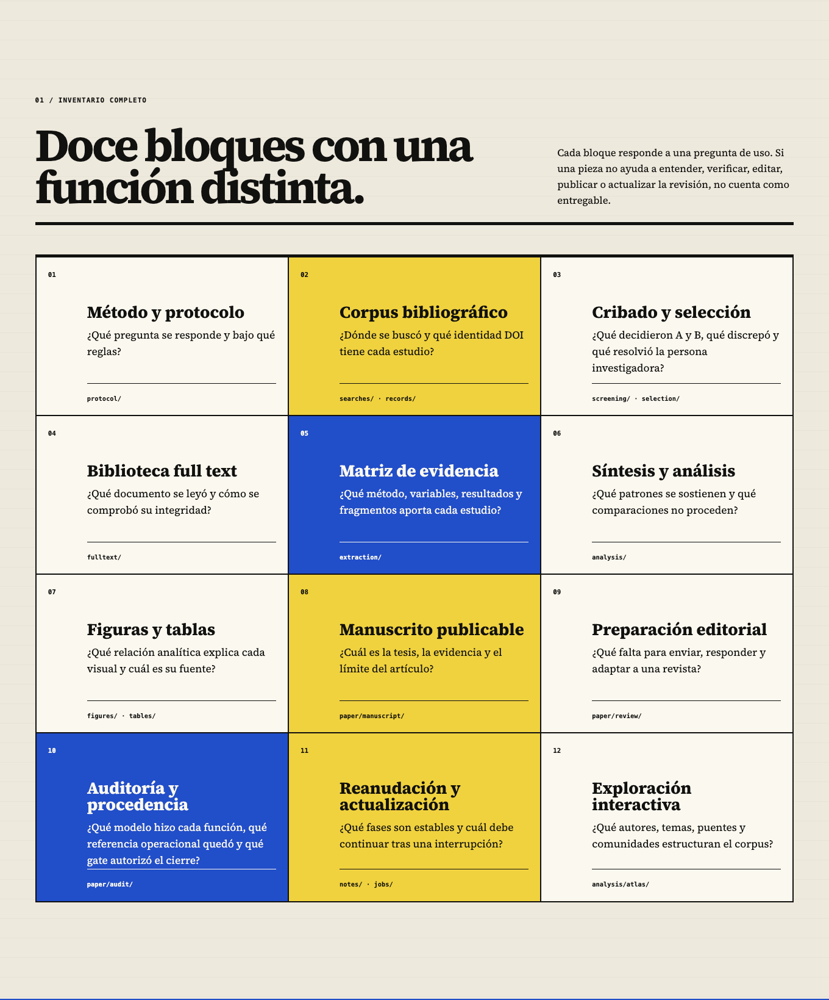
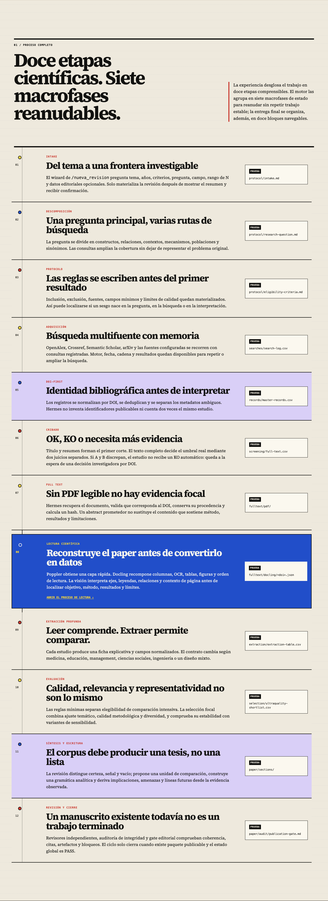
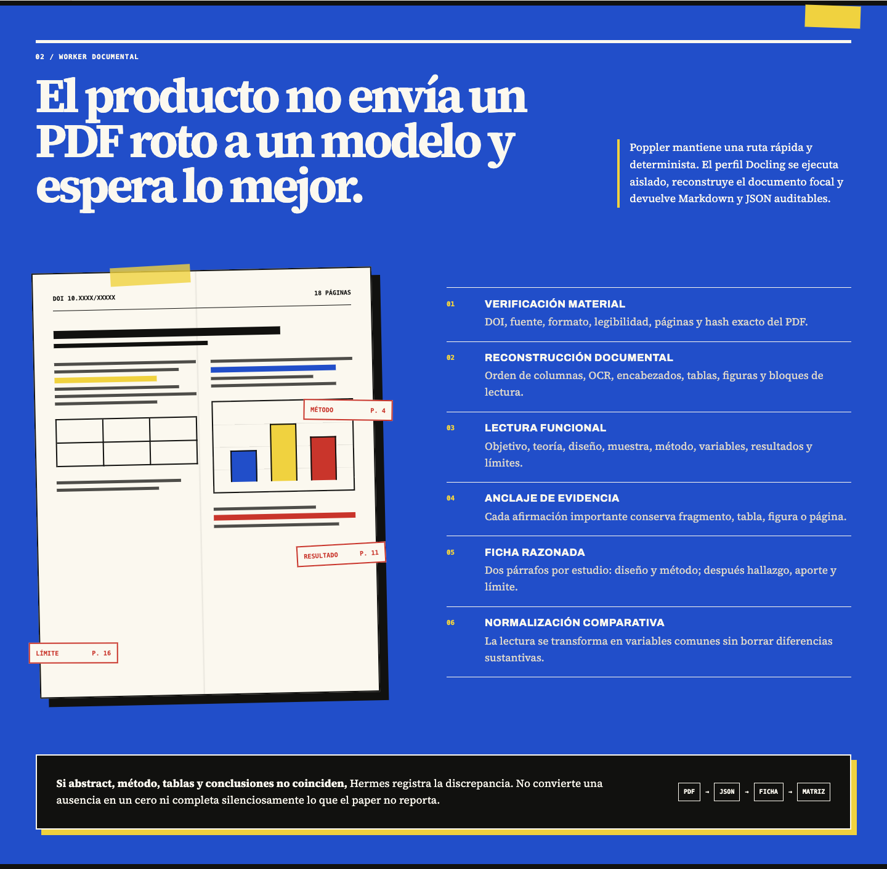
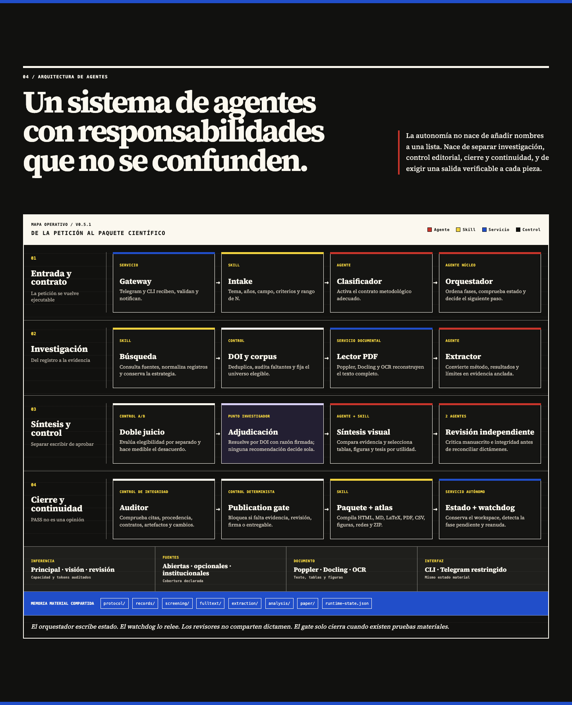

# Hermes Research Pack

[](https://github.com/686f6c61/Hermes-Research-PRISMA/actions/workflows/ci.yml)
[](https://github.com/686f6c61/Hermes-Research-PRISMA/releases/latest)
[](LICENSE)

Hermes Research Pack convierte Hermes Agent en un entorno reproducible para
revisiones sistemáticas de literatura. Parte de una pregunta y un protocolo
explícitos, busca y normaliza el corpus, conserva el texto completo, extrae
evidencia, redacta, revisa y solo cierra cuando existen entregables auditables.

No es un generador de resúmenes ni promete sustituir el juicio académico. Es
una distribución Docker, un plugin y un contrato de artefactos que hacen
visible qué decidió el sistema, con qué evidencia y dónde debe intervenir una
persona antes de publicar.

[](https://hermes-prisma.686f6c61.dev/)

## Estado del proyecto

La versión actual es una distribución Docker reproducible que incorpora un
plugin `standalone` y fija Hermes Agent a una versión concreta. Los comandos
públicos, el estado conversacional, el wizard y las skills se registran mediante
la API oficial del plugin. La imagen no reemplaza módulos de CLI o gateway:
`make plugin-only` compara esos archivos byte a byte con el commit upstream,
carga el plugin y arranca el gateway en un entorno aislado.

Docker aporta el runtime reproducible, LaTeX, Poppler, Docling y los controles
de seguridad; la integración funcional con Hermes es `plugin-only`. El
inventario técnico está en
[MIGRATION-MANIFEST.md](seed/hermes-home/plugins/hermes_research/MIGRATION-MANIFEST.md).

## Qué obtiene una persona

- Inicio guiado desde CLI o Telegram.
- Criterios de inclusión y exclusión materializados antes de buscar.
- Búsqueda multifuente, normalización DOI y deduplicación.
- Cribado de título/resumen y texto completo con justificación persistente.
- Lectura de PDF con Poppler y extracción estructurada opcional con Docling.
- Matriz de evidencia, tablas, figuras y fichas por estudio.
- Atlas HTML offline de autores, temas, referencias y evidencia, con centralidad, comunidades, cobertura y deriva entre fases.
- Manuscrito Markdown, LaTeX editable y PDF.
- Revisión independiente, auditoría de integridad y gate de publicación.
- Guía HTML offline que explica los doce bloques de la entrega y enlaza cada
  archivo desde un punto de entrada útil.
- Manifiesto JSON con estado, tamaño y SHA-256 de cada entregable público.
- Ledger que conecta afirmaciones críticas, citas, DOI, fragmentos y páginas.
- Procedencia de modelos por función y prueba explícita de sus capacidades.
- Estado recuperable, watchdog autónomo y sincronización local con Obsidian.

[](https://hermes-prisma.686f6c61.dev/entregables.html)

## Dónde trabaja bien

El paquete no aplica una plantilla genérica a cualquier pregunta. El intake
declara o infiere un perfil metodológico y ese perfil cambia el marco de la
pregunta, las fuentes recomendadas, los ejes de cribado, la evaluación crítica,
los pesos de selección y la forma de sintetizar:

| Perfil | Unidad de comparación | Fuentes especialmente relevantes |
| --- | --- | --- |
| Biomédico | Población, intervención o exposición, comparador y outcome | PubMed, Europe PMC, ClinicalTrials.gov y fuentes generales |
| Técnico | Sistema, arquitectura, tarea, dataset, benchmark y métrica | arXiv, OpenAlex, Crossref, Semantic Scholar, OpenAIRE y Lens |
| Ciencias sociales | Constructo, contexto, método, mecanismo y evidencia | OpenAlex, Crossref, Semantic Scholar, OpenAIRE y Lens |
| Educación | Actividad educativa, actor, sistema, contexto y resultado | ERIC, OpenAlex, Crossref, Semantic Scholar, OpenAIRE y Lens |
| Management | Teoría, contexto, variable, unidad de análisis y resultado | OpenAlex, Crossref, Semantic Scholar, OpenAIRE y Lens |
| Mixto | Unidad principal declarada y controles de los perfiles secundarios | Combinación trazable de las fuentes pertinentes |

Las fuentes de suscripción, como Scopus, Web of Science, Embase, PsycINFO,
IEEE Xplore o ACM Digital Library, necesitan acceso y configuración propios.
El router mejora la adecuación metodológica, pero no sustituye la validación
de una persona especialista en el campo.

## Instalación rápida

Requisitos: macOS o Linux, Docker con Compose v2, Python 3.11 o superior y un
proveedor de inferencia compatible con la API de OpenAI.

Descarga el ZIP y su checksum desde la
[release más reciente](https://github.com/686f6c61/Hermes-Research-PRISMA/releases/latest).
Después, dentro de la carpeta descomprimida:

```bash
./hermes-research setup
./hermes-research up
./hermes-research capability-test
./hermes-research multimodal-test
./hermes-research smoke-test
```

`setup` crea la estructura necesaria si es la primera ejecución, solicita el
proveedor y los modelos sin mostrar los secretos y guarda `.env` con permisos
`0600`. `up` ejecuta el diagnóstico antes de construir y levantar los
contenedores.

Para una instalación solo por terminal, elige el modo `cli`. Telegram es
opcional; si lo activas, crea primero un bot dedicado con BotFather y entrega
su token únicamente al asistente local de configuración.

La guía completa está en [docs/installation.md](docs/installation.md).

## Primera revisión

El wizard CLI pregunta los campos obligatorios si se omiten:

```bash
./hermes-research init
```

También puede ejecutarse de forma reproducible:

```bash
./hermes-research init \
  --topic "Impacto de la IA en la carga de trabajo docente universitaria" \
  --question "¿En qué condiciones la IA reduce, desplaza o aumenta la carga de trabajo?" \
  --years 2024-2026 \
  --include "Estudios empíricos con texto completo y resultados sobre trabajo docente" \
  --exclude "Opinión, marketing y estudios sin resultados recuperables" \
  --final-n 23-63
```

Después:

```bash
./hermes-research status
./hermes-research resume
./hermes-research package
```

En Telegram, la superficie pública es `/start`, `/nueva_revision`, `/estado`,
`/reanudar`, `/cancelar` y `/ayuda`.

## Qué ocurre por dentro

1. El intake convierte el tema en una frontera investigable.
2. La pregunta se descompone en constructos, relaciones, contextos y sinónimos.
3. El protocolo fija criterios y límites antes del primer resultado.
4. La adquisición consulta fuentes académicas y conserva cada búsqueda.
5. La normalización DOI deduplica y separa identidades ambiguas.
6. El cribado registra decisión, motivo, score y nivel de evidencia.
7. La recuperación exige texto completo legible y verificable.
8. La lectura reconstruye el PDF, sus tablas, figuras y orden documental.
9. La extracción conserva métodos, muestras, variables, resultados y límites.
10. La evaluación separa elegibilidad, calidad y representatividad.
11. La síntesis convierte el corpus en una tesis y una gramática comparativa.
12. La revisión independiente, la auditoría y el gate deciden el cierre.

El análisis estructural conecta autores, temas, referencias y dimensiones sin
intervenir en la selección. Después, el empaquetado abre con `index.html`,
recalcula hashes, elimina rutas e identificadores internos y conserva un estado
que el watchdog puede reanudar sin repetir fases estables.

[](https://hermes-prisma.686f6c61.dev/#proceso)

Consulta [docs/architecture.md](docs/architecture.md),
[docs/methodology.md](docs/methodology.md) y
[docs/artifacts.md](docs/artifacts.md) para el contrato detallado.

## Cómo lee un paper

Hermes no trata el PDF como una cadena de texto. Primero verifica DOI, fuente,
formato, páginas y hash; después reconstruye columnas, OCR, encabezados, tablas,
figuras y orden de lectura. La lectura funcional localiza objetivo, teoría,
diseño, muestra, método, variables, resultados y límites.

Cada afirmación importante puede conservar su página, fragmento, tabla o figura.
La ficha razonada y la matriz comparativa se generan después de esa lectura. Una
ausencia de reporte permanece como ausencia: no se convierte automáticamente en
cero ni se completa por inferencia.

[](https://hermes-prisma.686f6c61.dev/#lectura)

## Arquitectura de agentes

El orquestador, el extractor, el sintetizador y el auditor no comparten la misma
responsabilidad. Las skills ejecutan tareas acotadas; los servicios mantienen
entrada, lectura documental, persistencia y continuidad; los controles
deterministas impiden cerrar si falta evidencia o un entregable.

El estado común vive en archivos materiales, no en la memoria de una
conversación. El watchdog puede releerlos y reanudar, mientras los revisores
independientes emiten dictámenes separados antes de la decisión editorial.

[](https://hermes-prisma.686f6c61.dev/#agentes)

## Modos y datos

- `cli`: no necesita Telegram.
- `telegram`: interacción conversacional y ejecución autónoma.
- `both`: conserva ambas entradas.

Los datos viven en `runtime/workspace`, la configuración mutable en
`runtime/hermes-home` y la sincronización opcional en `runtime/obsidian`.
Detener los contenedores no borra esas carpetas.

El paquete no publica puertos por defecto. Sí necesita salida hacia el proveedor
de modelos, Telegram cuando esté activado y las fuentes bibliográficas.

## Calidad y límites

Una revisión no recibe `PASS` por tener texto. Deben existir protocolo, corpus,
decisiones trazables, extracción, manuscrito, LaTeX, PDF, paquete editable,
revisión independiente y auditoría. Las cifras y afirmaciones deben enlazar con
la matriz de evidencia. El rango de N es un objetivo operativo, nunca una cuota
que fuerce inclusiones.

El paquete distingue tres políticas de validación: `autonomous`, `assisted` y
`adjudicated`. La última no puede cerrar sin un registro humano válido. Las
evaluaciones golden miden por separado precisión y recall del cribado, exactitud
de extracción y localización de evidencia; un test sintético demuestra el
harness, pero nunca se presenta como validación científica del modelo.

La disponibilidad de una fuente no autoriza automáticamente su descarga o
redistribución. La persona responsable debe revisar licencias, términos de uso,
datos personales, autoría y políticas editoriales. El resultado requiere
revisión académica humana antes de enviarse a una revista.

## Documentación

- [Inicio en 10 minutos](docs/quickstart.md)
- [Instalación](docs/installation.md)
- [Configuración](docs/configuration.md)
- [Comandos](docs/commands.md)
- [Operación y copias de seguridad](docs/operations.md)
- [Proveedores y modelos](docs/providers.md)
- [PDF y Docling](docs/docling.md)
- [Privacidad y datos](docs/privacy.md)
- [Actualización](docs/upgrading.md)
- [Resolución de problemas](docs/troubleshooting.md)
- [Seguridad](SECURITY.md)
- [Soporte](SUPPORT.md)
- [Contribuir](CONTRIBUTING.md)
- [Código de conducta](CODE_OF_CONDUCT.md)
- [Compatibilidad](COMPATIBILITY.md)
- [Proceso de release](docs/release-process.md)

## Citar el software

GitHub puede generar una cita desde [CITATION.cff](CITATION.cff). Para una
revisión reproducible, cita la versión exacta y conserva también el
`RELEASE-MANIFEST.json` y el checksum del ZIP utilizado.

## Compatibilidad y licencia

La versión `0.4.0` está fijada a Hermes Agent `v2026.7.20`, commit
`3ef6bbd201263d354fd83ec55b3c306ded2eb72a`. No se recomienda mezclar el
plugin con otra versión de Hermes sin ejecutar la matriz completa de pruebas.

Hermes Research Pack se distribuye bajo licencia MIT. Los componentes de
terceros conservan sus propias licencias; consulta
[THIRD_PARTY_NOTICES.md](THIRD_PARTY_NOTICES.md).
